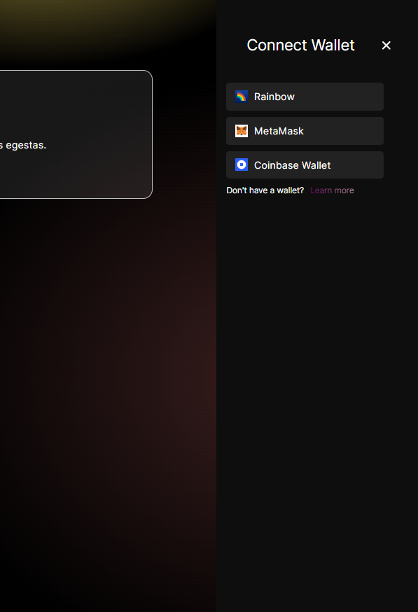

For @saksijas: This is mostly ready, just some minor work left with styling the modal, but you can start looking through it

1. connecting wallet as designed on figma
2. adding title, description, and file via form
3. When you add a file, it is immediately sent to ipfs so first enter title and description
4. file and json metadata are added (there are notification toasts informing user about progress)
5. when file and metadata are uploaded you can mint. Mint button calls mint function on the provided smart contract
6. after mint action fininshes, modal is opened that fetches metadata from ipfs. It then extracts image link from metadata and fetches the image, presenting image, title and description on the modal

   Contact me if you have problems adding correct env values, I used my own projectId




This is a [Next.js](https://nextjs.org/) project bootstrapped with [`create-next-app`](https://github.com/vercel/next.js/tree/canary/packages/create-next-app).

## Getting Started

First, run the development server:

```bash
npm run dev
# or
yarn dev
# or
pnpm dev
# or
bun dev
```

Open [http://localhost:3000](http://localhost:3000) with your browser to see the result.

You can start editing the page by modifying `app/page.tsx`. The page auto-updates as you edit the file.

This project uses [`next/font`](https://nextjs.org/docs/basic-features/font-optimization) to automatically optimize and load Inter, a custom Google Font.

## Learn More

To learn more about Next.js, take a look at the following resources:

- [Next.js Documentation](https://nextjs.org/docs) - learn about Next.js features and API.
- [Learn Next.js](https://nextjs.org/learn) - an interactive Next.js tutorial.

You can check out [the Next.js GitHub repository](https://github.com/vercel/next.js/) - your feedback and contributions are welcome!

## Deploy on Vercel

The easiest way to deploy your Next.js app is to use the [Vercel Platform](https://vercel.com/new?utm_medium=default-template&filter=next.js&utm_source=create-next-app&utm_campaign=create-next-app-readme) from the creators of Next.js.

Check out our [Next.js deployment documentation](https://nextjs.org/docs/deployment) for more details.
